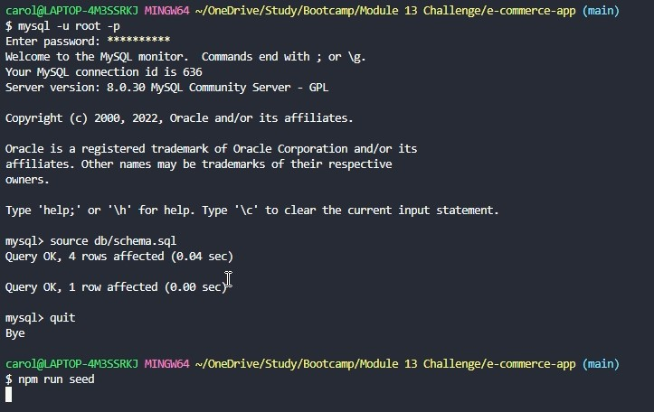
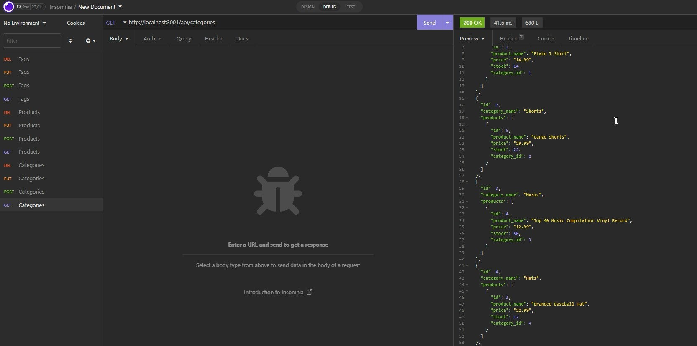
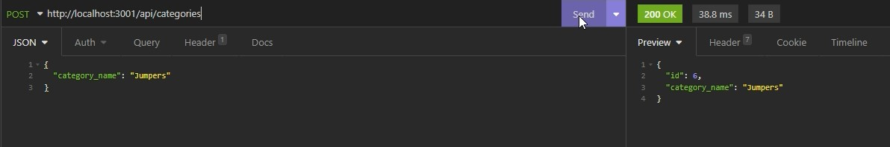
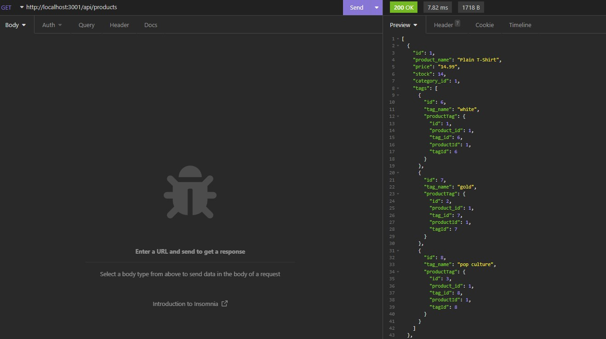
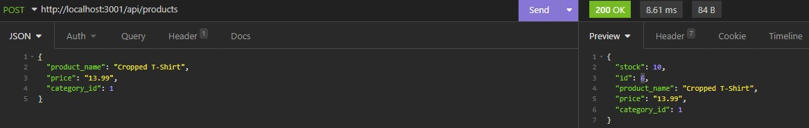
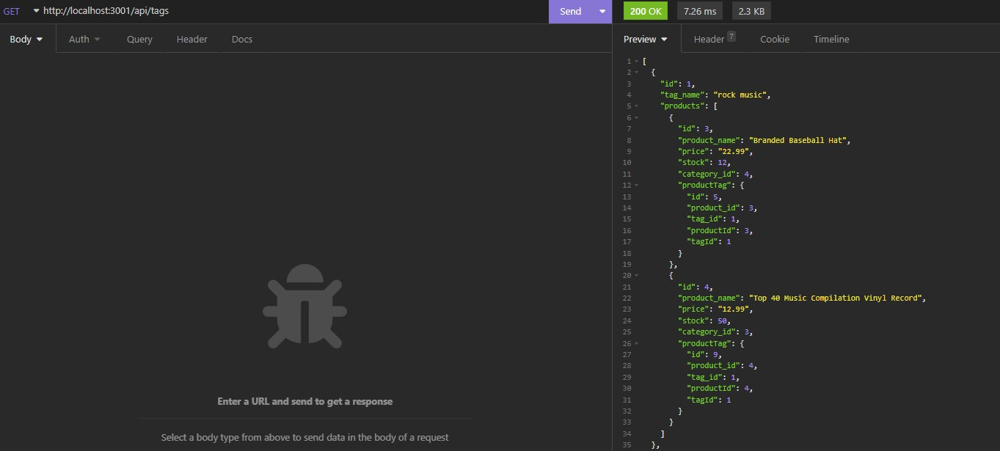
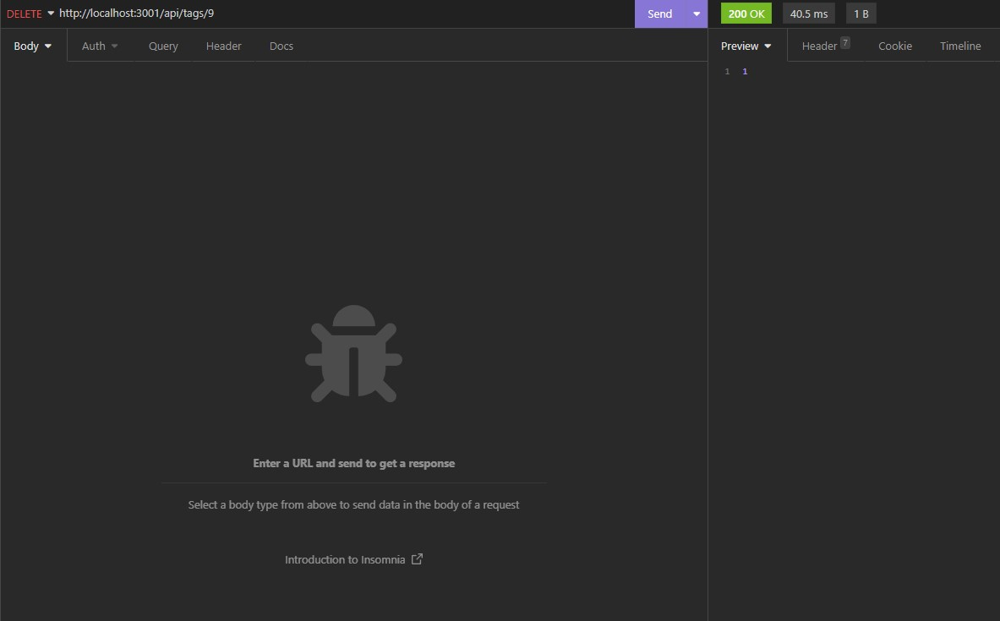

# E-commerce Application
## Description
Back end application for an e-commerce site, using Express.js API, configured using Sequelize to interact with a MySQL database.

## Table of Contents
1. [User Story](#user-story)
1. [Acceptance Criteria](#acceptance-criteria)
1. [Installation](#installation)
1. [Usage](#usage)
1. [Screenshots](#screenshots)
1. [Links](#links)

## User Story
```
AS A manager at an internet retail company
I WANT a back end for my e-commerce website that uses the latest technologies
SO THAT my company can compete with other e-commerce companies
```

## Acceptance Criteria
```
GIVEN a functional Express.js API
WHEN I add my database name, MySQL username, and MySQL password to an environment variable file
THEN I am able to connect to a database using Sequelize
WHEN I enter schema and seed commands
THEN a development database is created and is seeded with test data
WHEN I enter the command to invoke the application
THEN my server is started and the Sequelize models are synced to the MySQL database
WHEN I open API GET routes in Insomnia Core for categories, products, or tags
THEN the data for each of these routes is displayed in a formatted JSON
WHEN I test API POST, PUT, and DELETE routes in Insomnia Core
THEN I am able to successfully create, update, and delete data in my database
```

## Installation
1. Install all dependencies by running command 'npm i' in the terminal/command-line application within the main directory of the application
1. Create the database by running command 'mysql -u root -p' in the same command-line application. You will be required to login using your MySQL login details
1. Run command 'source db/schema.sql' - make sure you are using the correct file path
1. Quit the MySQL command-line and then
1. Seed the database by running command 'npm run seed'
1. To then start the application running on your localhost, use command 'npm start'
1. You can now start using Insomnia to do GET, POST, PUT and DELETE requests

## Usage
Use Insomnia to execute GET, POST, PUT and DELETE requests to the relevant routes

## Screenshots














## Links
GitHub: [https://github.com/carolinemae](https://github.com/carolinemae/e-commerce-app)

Video (demo): [https://drive.google.com/file](https://drive.google.com/file/d/166Ah5v_Ye2A192y014s9Sbla4Ax91fv1/view)

Email: [carolinemaee@live.com](mailto:carolinemaee@live.com)

[Back to the top](#e-commerce-application)